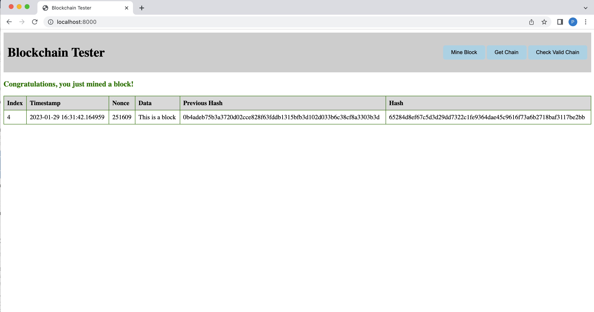
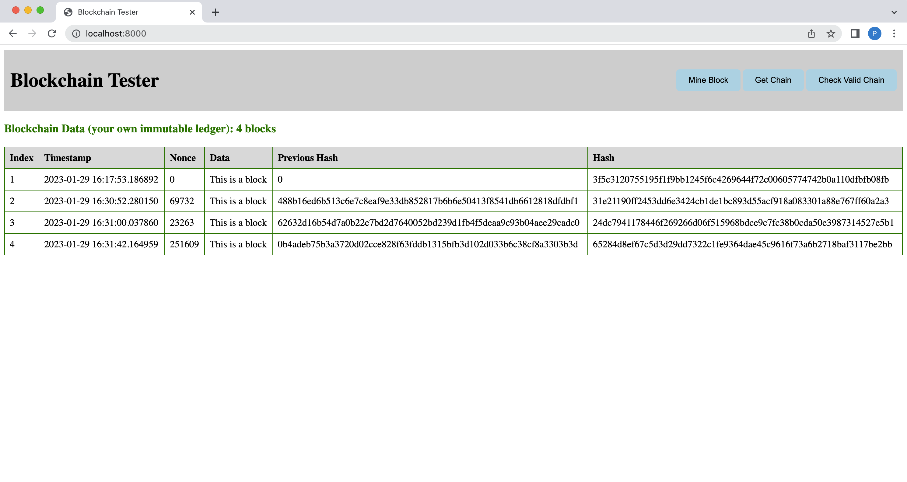
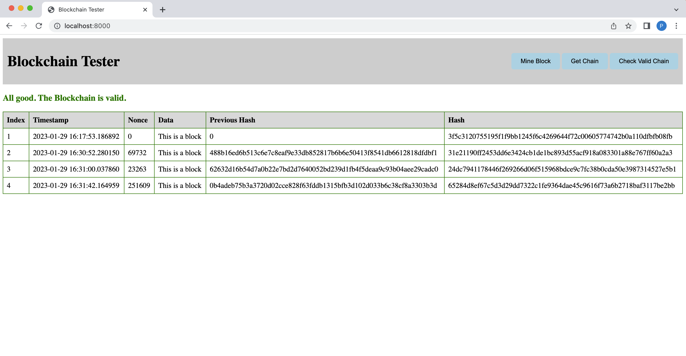

A very simple implementation of blockchain and its applications in Python.

- [Blockchain](#blockchain)
- [Cryptocurrency](#cryptocurrency)
- [Smart Contracts](#smart-contracts)

### Blockchain
To use the base functionality of the blockchain, you can use the `Blockchain` class. It has the following methods:
- `new_block`: Adds a block to the blockchain.
- `hash`: Hashes a block.
- `proof_of_work`: Simple Proof of Work Algorithm:
    - Find a number p' such that hash(pp') contains leading 4 zeroes, where p is the previous p', p is the previous nonce, and p' is the new nonce.
    - The number of leading zeroes can be changed by changing the `difficulty` variable.
    - The `proof_of_work` method returns the nonce that satisfies the above condition.
    - The `new_block` method calls the `proof_of_work` method to get the correct nonce for the new block.
- `check_valid_nonce`: Checks if the nonce satisfies the proof of work condition.
- `check_valid_chain`: Determines if a given blockchain is valid.

I also add a REST API server to serving these above functions. The API has the following endpoints:
- `/mine-block`: Mines a new block.
- `/get-chain`: Returns the full blockchain.
- `/is-valid`: Checks if the blockchain is valid.

In order to try out the demo, you can run the following commands:
```bash
# Install FastAPI and uvicorn
$ pip install fastapi uvicorn

# Run the server
$ uvicorn blockchain:app
```
Now, navigate to `http://localhost:8000/` to have a look at the demo page and `http://localhost:8000/docs` for the detail
documentations. The app behaviors should be like the following:
<figcaption align="center">Figure 1: Mine a block</figcaption>



<figcaption align="center">Figure 2: Get the blockchain</figcaption>



<figcaption align="center">Figure 3: Check if the blockchain is valid</figcaption>



Developed by [Duy Huynh](https://duy-huynh.com/), 2023.